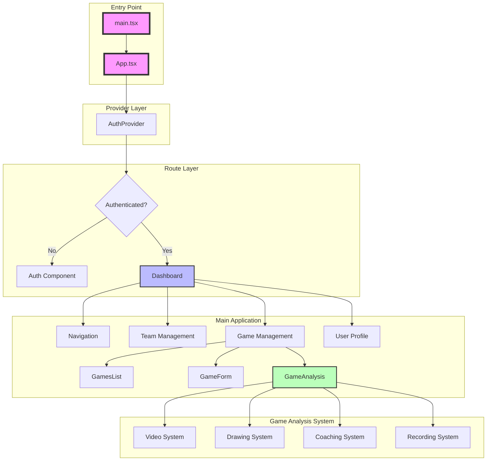
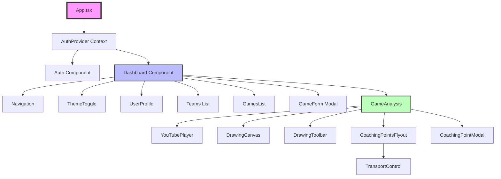
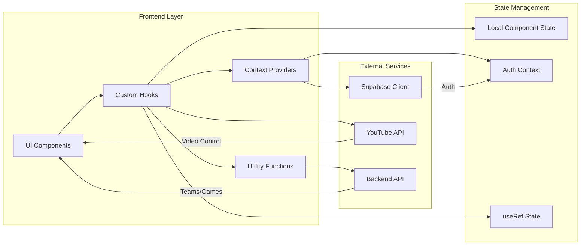
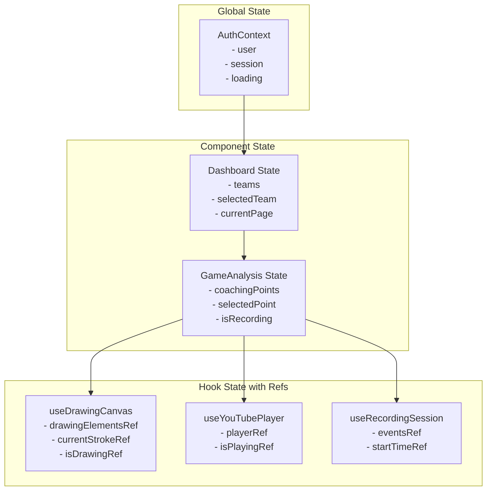
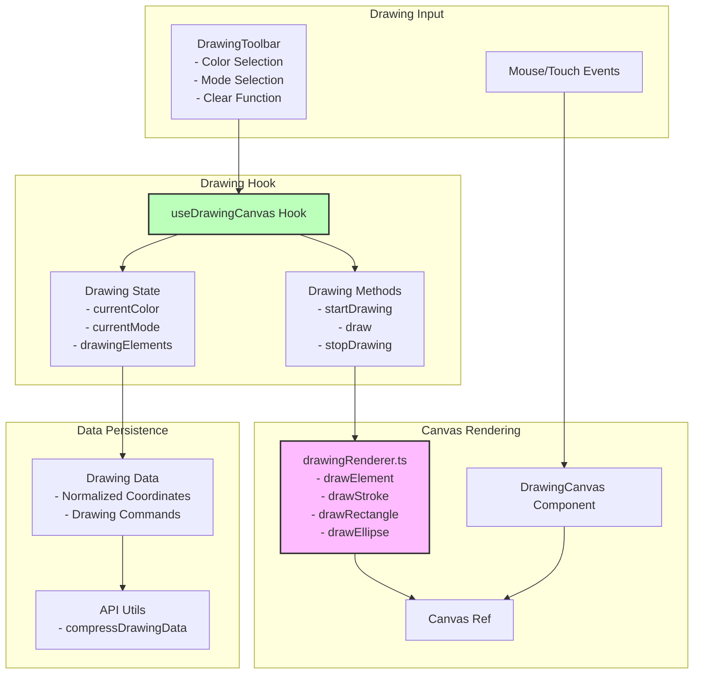
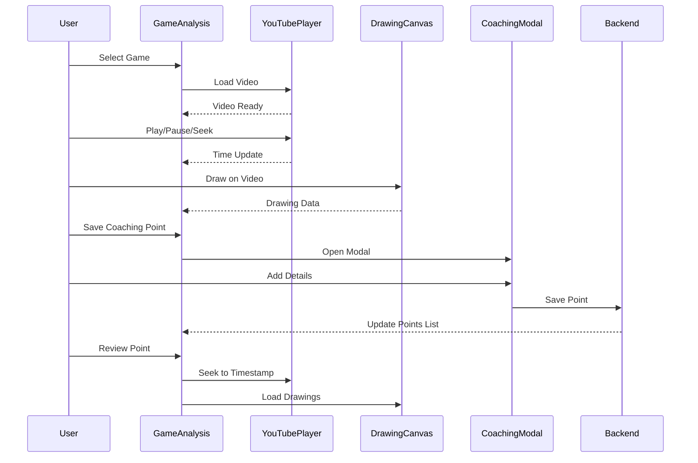
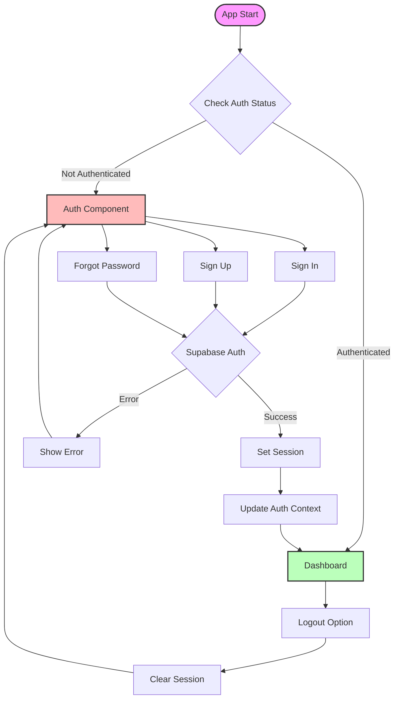
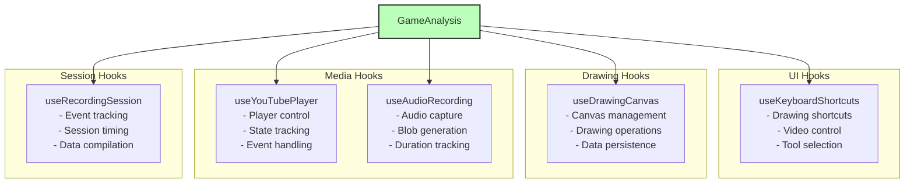
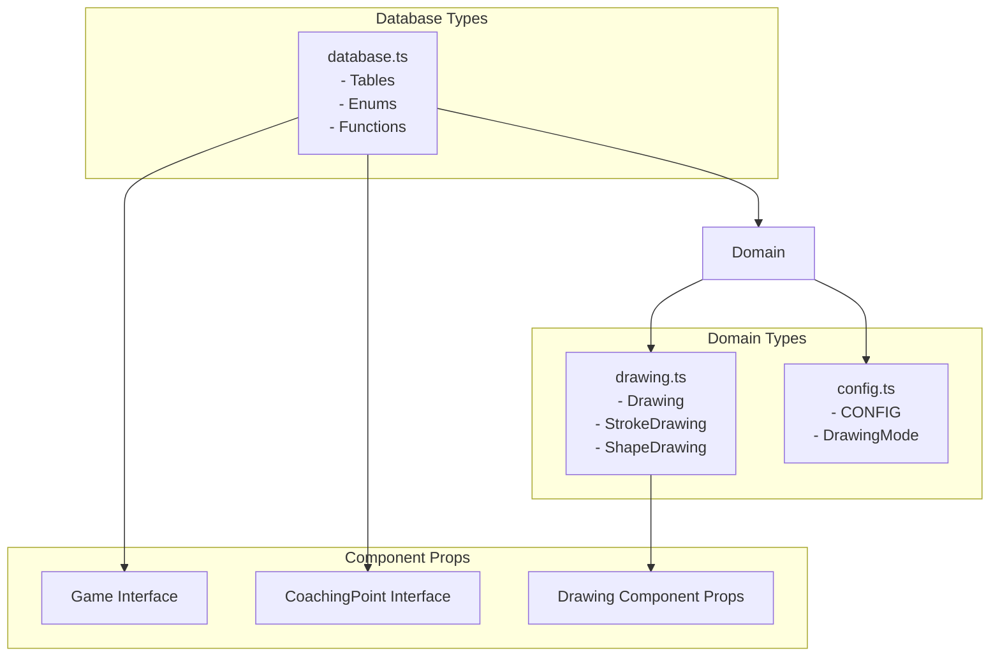
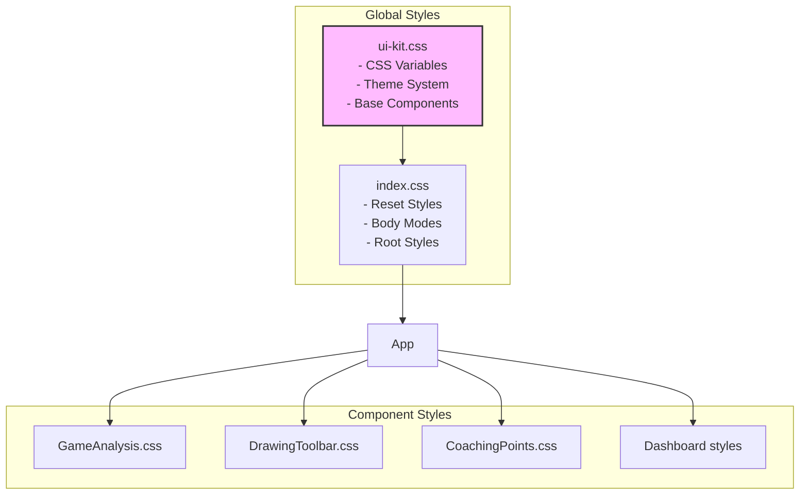

# TACTIX Frontend Architecture

This document provides a comprehensive overview of the TACTIX frontend architecture using Mermaid diagrams.

## Table of Contents
1. [High-Level Component Architecture](#high-level-component-architecture)
2. [Component Hierarchy & Composition](#component-hierarchy--composition)
3. [Data Flow Architecture](#data-flow-architecture)
4. [State Management](#state-management)
5. [Drawing System Architecture](#drawing-system-architecture)
6. [Video Analysis Flow](#video-analysis-flow)
7. [Authentication Flow](#authentication-flow)
8. [API Integration](#api-integration)

## High-Level Component Architecture



## Component Hierarchy & Composition



## Data Flow Architecture



## State Management



## Drawing System Architecture



## Video Analysis Flow



## Authentication Flow



## API Integration

```mermaid
graph LR
    subgraph "Frontend Services"
        TeamAPI[Team API<br/>- fetchTeams<br/>- createTeam<br/>- updateTeam]
        GameAPI[Game API<br/>- fetchGames<br/>- createGame<br/>- updateGame]
        CoachingAPI[Coaching API<br/>- fetchPoints<br/>- createPoint<br/>- uploadDrawings]
    end
    
    subgraph "API Utils"
        APIUtils[api.ts<br/>- getApiUrl<br/>- uploadAudio<br/>- compressDrawingData]
        AuthHeaders[Auth Headers<br/>- Bearer Token]
    end
    
    subgraph "Backend Endpoints"
        TeamEndpoints[/api/teams]
        GameEndpoints[/api/games]
        CoachingEndpoints[/api/coaching-points]
        StorageEndpoints[/api/storage]
    end
    
    TeamAPI --> APIUtils
    GameAPI --> APIUtils
    CoachingAPI --> APIUtils
    
    APIUtils --> AuthHeaders
    
    AuthHeaders --> TeamEndpoints
    AuthHeaders --> GameEndpoints
    AuthHeaders --> CoachingEndpoints
    AuthHeaders --> StorageEndpoints
    
    style APIUtils fill:#fbf,stroke:#333,stroke-width:2px
```

## Hooks Architecture



## Type System Overview



## CSS Architecture

