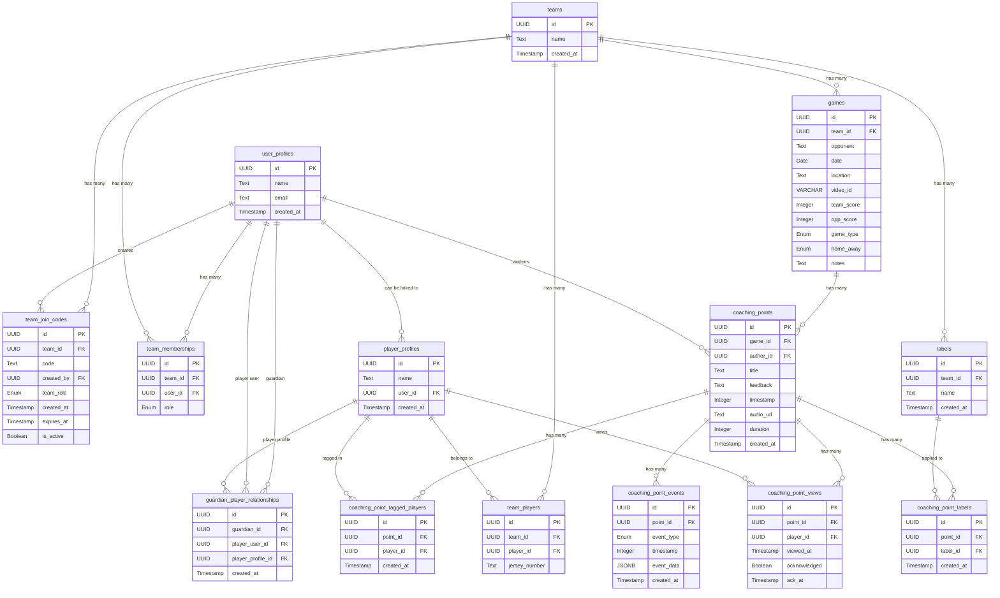

# DB Schema

## user_profiles
| Column       | Type      | Description                |
| ------------ | --------- | -------------------------- |
| `id`         | UUID (PK) | Unique user ID             |
| `name`       | Text      | Full name                  |
| `email`      | Text      | Unique login email         |
| `created_at` | Timestamp | Account creation timestamp |

## player_profiles
| Column           | Type      | Description                              |
| ---------------- | --------- | -----------------------------------------|
| `id`             | UUID (PK) | Unique player profile ID                 |
| `name`           | Text      | Player's full name                       |
| `user_id`        | UUID (FK) | References `user_profiles.id` (nullable) |
| `created_at`     | Timestamp | When profile was created                 |

## teams
| Column             | Type      | Description                      |
| ------------------ | --------- | -------------------------------- |
| `id`               | UUID (PK) | Unique team ID                   |
| `name`             | Text      | Team name                        |
| `created_at`       | Timestamp | Team creation timestamp          |

## team_join_codes
| Column       | Type      | Description                                                   |
| ------------ | --------- | ------------------------------------------------------------- |
| `id`         | UUID (PK) | Unique join code ID                                           |
| `team_id`    | UUID (FK) | References `teams.id`                                         |
| `code`       | Text      | Unique join code (e.g., "ABC123")                             |
| `created_by` | UUID (FK) | References `user_profiles.id` (coach)                         |
| `team_role`  | Enum      | Join as role (`coach`,`player`,`admin`,`guardian`) (nullable) |
| `created_at` | Timestamp | When code was created                                         |
| `expires_at` | Timestamp | When code expires (nullable)                                  |
| `is_active`  | Boolean   | Whether code can still be used                                |

## team_players
| Column         | Type      | Description                       |
| -------------- | --------- | --------------------------------- |
| `id`           | UUID (PK) | Unique membership ID              |
| `team_id`      | UUID (FK) | References `teams.id`             |
| `player_id`    | UUID (FK) | References `player_profiles.id`   |
| `jersey_number`| Text      | Player's jersey number (optional) |

## team_memberships
| Column      | Type      | Description                          |
| ----------- | --------- | -------------------------------------|
| `id`        | UUID (PK) | Unique membership ID                 |
| `team_id`   | UUID (FK) | References `teams.id`                |
| `user_id`   | UUID (FK) | References `user_profiles.id`        |
| `role`      | Enum      | (`coach`,`player`,`admin`,`guardian`)  |

## guardian_player_relationships
| Column             | Type      | Description                                      |
| ------------------ | --------- | -------------------------------------------------|
| `id`               | UUID (PK) | Unique relationship ID                           |
| `guardian_id`        | UUID (FK) | References `user_profiles.id` (guardian)       |
| `player_user_id`   | UUID (FK) | References `user_profiles.id` (child) (nullable) |
| `player_profile_id`| UUID (FK) | References `player_profiles.id`                  |
| `created_at`       | Timestamp | When relationship was created                    |

## games
| Column       | Type         | Description                            |
| ------------ | ------------ | ---------------------------------------|
| `id`         | UUID (PK)    | Unique game ID                         |
| `team_id`    | UUID (FK)    | References `teams.id`                  |
| `opponent`   | Text         | Opposing team name                     |
| `date`       | Date         | Date of the game                       |
| `location`   | Text         | Where the game was played              |
| `video_id`   | VARCHAR(11)  | YouTube Video ID                       |
| `team_score` | Integer (≥0) | Our team's score                       |
| `opp_score`  | Integer (≥0) | Opponent's score                       |
| `game_type`  | Enum         | (`regular`, `tournament`, `scrimmage`) |
| `home_away`  | Enum         | (`home`, `away`, `neutral`)            |
| `notes`      | Text         | General game notes                     |

## coaching_points
| Column        | Type      | Description                           |
| ------------- | --------- | ------------------------------------- |
| `id`          | UUID (PK) | Unique point ID                       |
| `game_id`     | UUID (FK) | References `games.id`                 |
| `author_id`   | UUID (FK) | References `user_profiles.id` (coach) |
| `title`       | Text      | Short summary                         |
| `feedback`    | Text      | Detailed feedback                     |
| `timestamp`   | Integer   | Time in video in milliseconds         |
| `audio_url`   | Text      | URL to stored audio file              |
| `duration`    | Integer   | Total duration in milliseconds        |
| `created_at`  | Timestamp | When it was added                     |

## coaching_point_events
| Column        | Type      | Description                                       |
| ------------- | --------- | ------------------------------------------------- |
| `id`          | UUID (PK) | Unique event ID                                   |
| `point_id`    | UUID (FK) | References `coaching_points.id`                   |
| `event_type`  | Enum      | (`play`, `pause`, `seek`, `draw`, `change_speed`, `recording_start`) |
| `timestamp`   | Integer   | Milliseconds from recording start                 |
| `event_data`  | JSONB     | Event-specific data                               |
| `created_at`  | Timestamp | When event was recorded                           |

### Event Data Formats

#### `recording_start` event_data format:
```json
{
  "playbackSpeed": 1.0,
  "videoTimestamp": 0,
  "existingDrawings": []
}
```

This event captures the initial state when a coaching point recording begins, allowing playback to restore the correct video speed, position, and canvas drawings.

## coaching_point_tagged_players
| Column        | Type      | Description                           |
| ------------- | --------- | ------------------------------------- |
| `id`          | UUID (PK) | Unique tag ID                         |
| `point_id`    | UUID (FK) | References `coaching_points.id`       |
| `player_id`   | UUID (FK) | References `player_profiles.id`       |
| `created_at`  | Timestamp | When tag was created                  |

## labels
| Column        | Type      | Description                           |
| ------------- | --------- | ------------------------------------- |
| `id`          | UUID (PK) | Unique label ID                       |
| `team_id`     | UUID (FK) | References `teams.id`                 |
| `name`        | Text      | Label text (e.g., "corner kick")      |
| `created_at`  | Timestamp | When label was created                |

## coaching_point_labels
| Column        | Type      | Description                           |
| ------------- | --------- | ------------------------------------- |
| `id`          | UUID (PK) | Unique association ID                 |
| `point_id`    | UUID (FK) | References `coaching_points.id`       |
| `label_id`    | UUID (FK) | References `labels.id`                |
| `created_at`  | Timestamp | When label was applied                |

## coaching_point_views
| Column        | Type      | Description                           |
| ------------- | --------- | ------------------------------------- |
| `id`          | UUID (PK) | Unique view ID                        |
| `point_id`    | UUID (FK) | References `coaching_points.id`       |
| `player_id`   | UUID (FK) | References `player_profiles.id`       |
| `viewed_at`   | Timestamp | When user first viewed the point      |
| `acknowledged`| Boolean   | Whether user acknowledged the point   |
| `ack_at`      | Timestamp | When user acknowledged (nullable)     |

# Diagram

