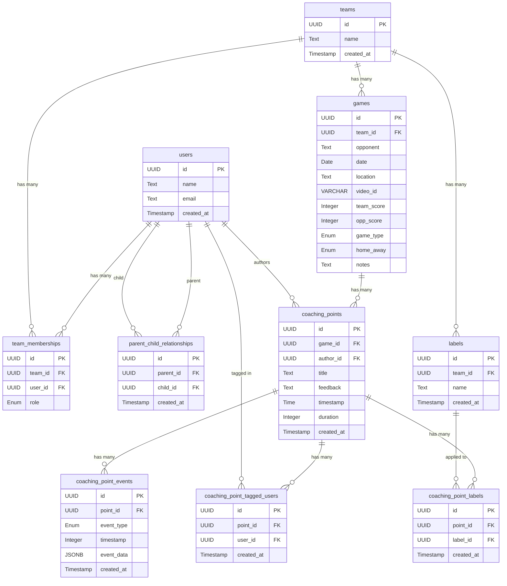

# DB Schema

## users
| Column       | Type      | Description                |
| ------------ | --------- | -------------------------- |
| `id`         | UUID (PK) | Unique user ID             |
| `name`       | Text      | Full name                  |
| `email`      | Text      | Unique login email         |
| `created_at` | Timestamp | Account creation timestamp |

## teams
| Column       | Type      | Description             |
| ------------ | --------- | ----------------------- |
| `id`         | UUID (PK) | Unique team ID          |
| `name`       | Text      | Team name               |
| `created_at` | Timestamp | Team creation timestamp |

## team_memberships
| Column      | Type      | Description                         |
| ----------- | --------- | ------------------------------------|
| `id`        | UUID (PK) | Unique membership ID                |
| `team_id`   | UUID (FK) | References `teams.id`               |
| `user_id`   | UUID (FK) | References `users.id`               |
| `role`      | Enum      | (`coach`,`player`,`admin`,`parent`) |

## parent_child_relationships
| Column      | Type      | Description                         |
| ----------- | --------- | ------------------------------------|
| `id`        | UUID (PK) | Unique relationship ID              |
| `parent_id` | UUID (FK) | References `users.id` (parent)      |
| `child_id`  | UUID (FK) | References `users.id` (child)       |
| `created_at`| Timestamp | When relationship was created       |

## games
| Column       | Type         | Description                            |
| ------------ | ------------ | ---------------------------------------|
| `id`         | UUID (PK)    | Unique game ID                         |
| `team_id`    | UUID (FK)    | References `teams.id`                  |
| `opponent`   | Text         | Opposing team name                     |
| `date`       | Date         | Date of the game                       |
| `location`   | Text         | Where the game was played              |
| `video_id`   | VARCHAR(11)  | YouTube Video ID                       |
| `team_score` | Integer (≥0) | Our team's score                       |
| `opp_score`  | Integer (≥0) | Opponent's score                       |
| `game_type`  | Enum         | (`regular`, `tournament`, `scrimmage`) |
| `home_away`  | Enum         | (`home`, `away`, `neutral`)            |
| `notes`      | Text         | General game notes                     |

## coaching_points
| Column        | Type      | Description                           |
| ------------- | --------- | ------------------------------------- |
| `id`          | UUID (PK) | Unique point ID                       |
| `game_id`     | UUID (FK) | References `games.id`                 |
| `author_id`   | UUID (FK) | References `users.id` (coach)         |
| `title`       | Text      | Short summary                         |
| `feedback`    | Text      | Detailed feedback                     |
| `timestamp`   | Time      | Time in video (e.g., 12:34)           |
| `audio_url`   | Text      | URL to stored audio file              |
| `duration`    | Integer   | Total duration in milliseconds        |
| `created_at`  | Timestamp | When it was added                     |

## coaching_point_events
| Column        | Type      | Description                                       |
| ------------- | --------- | ------------------------------------------------- |
| `id`          | UUID (PK) | Unique event ID                                   |
| `point_id`    | UUID (FK) | References `coaching_points.id`                   |
| `event_type`  | Enum      | (`play`, `pause`, `seek`, `draw`, `change_speed`) |
| `timestamp`   | Integer   | Milliseconds from recording start                 |
| `event_data`  | JSONB     | Event-specific data                               |
| `created_at`  | Timestamp | When event was recorded                           |

## coaching_point_tagged_users
| Column        | Type      | Description                           |
| ------------- | --------- | ------------------------------------- |
| `id`          | UUID (PK) | Unique tag ID                         |
| `point_id`    | UUID (FK) | References `coaching_points.id`       |
| `user_id`     | UUID (FK) | References `users.id`                 |
| `created_at`  | Timestamp | When tag was created                  |

## labels
| Column        | Type      | Description                           |
| ------------- | --------- | ------------------------------------- |
| `id`          | UUID (PK) | Unique label ID                       |
| `team_id`     | UUID (FK) | References `teams.id`                 |
| `name`        | Text      | Label text (e.g., "corner kick")      |
| `created_at`  | Timestamp | When label was created                |

## coaching_point_labels
| Column        | Type      | Description                           |
| ------------- | --------- | ------------------------------------- |
| `id`          | UUID (PK) | Unique association ID                 |
| `point_id`    | UUID (FK) | References `coaching_points.id`       |
| `label_id`    | UUID (FK) | References `labels.id`                |
| `created_at`  | Timestamp | When label was applied                |

# Diagram

